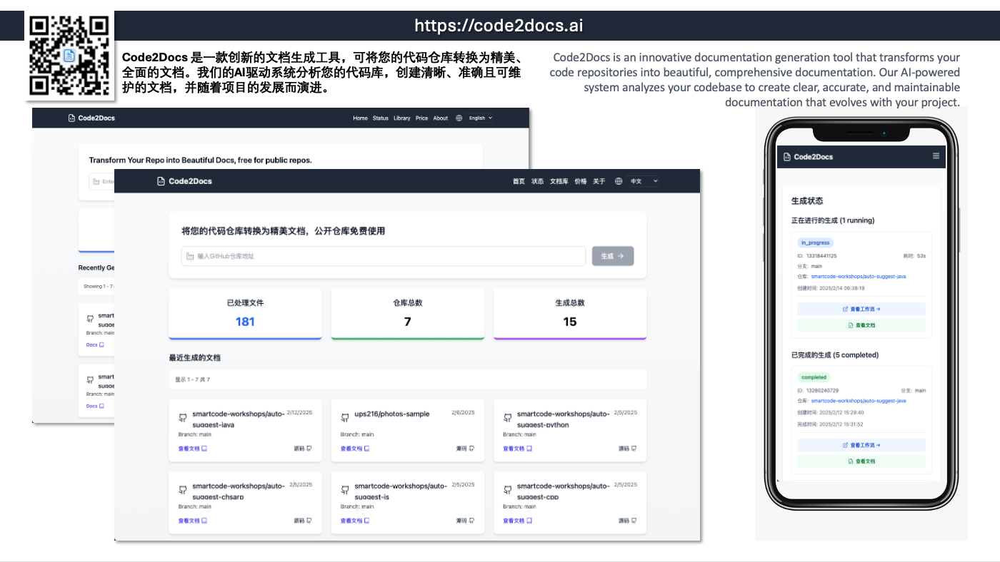

# Code2Docs.ai

[English](README.md) | 简体中文

## Code2Docs.ai 概述
Code2Docs.ai 是一个结合AI分析和自动化工作流的文档生成系统。它包含三个主要组件：

1. **code2docs-ai-web**: 用于生成和管理文档的现代化Web界面
2. **code2docs-ai-core**: 用于仓库处理的核心GitHub Action工作流
3. **aise-cli**: 用于AI辅助软件工程任务的命令行工具

该系统通过直观的界面和强大的后端处理，自动将GitHub仓库转换为全面的文档。

## 支持场景
- **一键文档生成**: 从任何GitHub仓库生成全面文档
- **实时进度跟踪**: 监控文档生成状态
- **文档库**: 访问和管理之前生成的文档
- **仓库分析**: 解析和分析仓库结构和内容
- **文档导出**: 以各种格式导出生成的文档
- **工作流自动化**: 通过GitHub Actions自动化文档生成

## 组件
### code2docs-ai-web
- 使用React、TypeScript和TailwindCSS构建的现代化Web界面
- 具有实时进度跟踪和文档管理功能
- 支持多语言界面（英语和中文）

### code2docs-ai-core
- 用于自动化仓库处理的GitHub Action工作流
- 处理仓库克隆、分析和文档生成
- 包含错误处理和状态跟踪

### aise-cli
- 用于AI辅助软件工程的命令行界面
- 支持仓库解析、文档导出和AI交互
- 包含API和Web界面组件

## 版权
© 2025 Code2Docs。保留所有权利。
